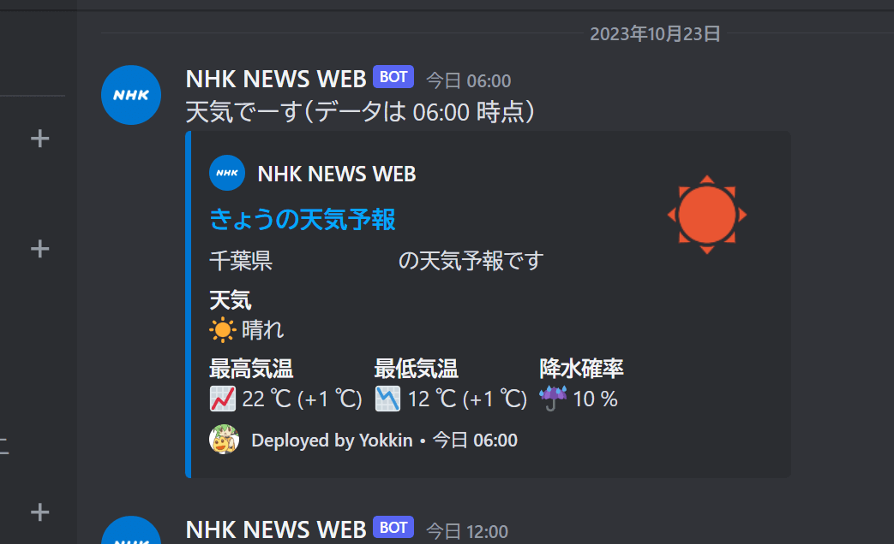

# Forecast-Auto-Post

This tool allows you to retrieve the forecast data from the backend API of NHK NEWS Web, and then post it to Discord.




## Setup

Clone this repository.

```
git clone
```

Setup your own `.env` file in this way, and place it on `../app`:

```bash
PLACE_ID=
WEBHOOK_URL=
```

`PLACE_ID` is the rightmost flagment of the URL, which is `13101001310100`.  With this unique ID allocated to each location, we can have this tool get some data.
```
https://www.nhk.or.jp/kishou-saigai/city/weather/13101001310100/
```
`WEBHOOK_URL` can be a URL string representing Webhook URL. (guessing we don't need examples right?)

Resolve dependencies for this tool. Assuming you have Composer (a Dependency Manager for PHP) globally installed to your machine.

```bash
composer install
```

Start the application!
```
chmod +x ./forecast
./forecast
```


## Epilog

Tested machine:
```
PHP 8.3.0RC3 (cli) (built: Oct  6 2023 09:19:40) (NTS)
Copyright (c) The PHP Group
Zend Engine v4.3.0RC3, Copyright (c) Zend Technologies
    with Zend OPcache v8.3.0RC3, Copyright (c), by Zend Technologies
```