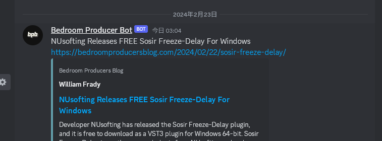

# Forecast-Auto-Post

This tool allows you to aggregate some of information that you would likely to utilize in your real life, such as weather forecast, RSS feed, and etc.

The application collects the articles from RSS feed you would like to subscribe, or the weather forecast of any locations in Japan which are going to be retrieved from the backend API of NHK NEWS Web. You can expect the tools to post such information on Discord.

The settings are saved by each webhook registrations that you can configure.

## Screenshots

An example screenshot showing the app posts weather forecasts of specified location.


An example screenshot the app posting articles based on RSS feeds.




## Setup

Clone this repository.

```
git clone
```

Resolve dependencies for this tool. Assuming you have Composer (a Dependency Manager for PHP) globally installed to your machine.

```bash
composer install
```

Create tables. 
```bash
sqlite3 sqlite.db < setup/create_table.sql
```

Note you can configure the database location via `app/Config/Config.php` or you can add `database-path=<PATH>` option to command-line argument.

```php
public const DATABASE_PATH = "/path/to/sqlite.db";
```

__The explanation about configuration on Database may be written later__

After you configure everything, you can run this script by:
```
./bin/minicli forecast
```

## Terms

Here I am trying to explain the meaning some of the collumn name used the database. To be added more.

### place_id
`place_id` is the rightmost flagment of the URL, which is `13101001310100`.  With this unique ID allocated to each location, we can have this tool get some data.
```
https://www.nhk.or.jp/kishou-saigai/city/weather/13101001310100/
```

### webhook_url

`webhook_url` can be a URL string representing Webhook URL. (guessing we don't need examples right?)

## Epilog

Tested machine:
```
PHP 8.3.3-1+ubuntu22.04.1+deb.sury.org+1 (cli) (built: Feb 15 2024 18:38:52) (NTS)
Copyright (c) The PHP Group
Zend Engine v4.3.3, Copyright (c) Zend Technologies
    with Zend OPcache v8.3.3-1+ubuntu22.04.1+deb.sury.org+1, Copyright (c), by Zend Technologies
```